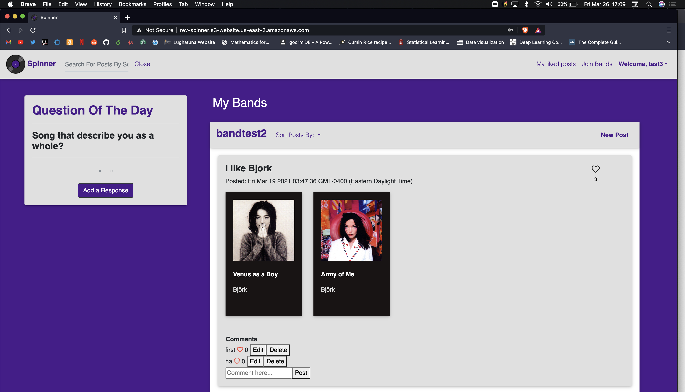

# Spinner
Spinner is a music-based social media app where users can connect with others over their love of music. Spinners (Spinner users) will be able to post their favorite songs and albums, as well as comment on and rate music posts. Spinner will have daily/weekly prompts (i.e “Songs that remind you of your childhood”) that users can respond to and vote on their favorite responses. Spinners can also create and follow groups based on their specific music interests.

## Technologies used
<ul>
  <li>Angular 10</li>
  <li>Spring Boot</li>
  <li>Spring Security</li>
  <li>AWS RDS, EC2, and S3</li>
  <li>Spotify API</li>
</ul>

## Features
<ul>
  <li>Users can create and join bands</li>
  <li>Users can contribute posts in their bands, and like and comment on others'</li>
  <li>Each day a new Question of the Day is available, which users can submit their response too and vote on their favorites</li>
</ul>
TODO:
<ul>
  <li>Adopt a RESTful approach to authentication and authorization to prevent issues with EC2</li>
</ul>

## Getting started
<ol>
  <li>Run  ` git clone https://github.com/ryanlansdon/SpinnerApp.git ` in a terminal</li>
  <li>Create or connect to an AWS RDS PostgreSQL database, and in a database management app such as DBeaver, run the SpinnerDDL.sql file</li>
  <li>In the application.properties file, be sure to set up like so:
    
    spring.datasource.url= <insert_database_public_dns_here>
    spring.datasource.username=<insert_database_username_here>
    spring.datasource.password=<insert_database_password_here>
    spring.datasource.driverClassName=org.postgresql.Driver
  </li>
  <li>Switch the CrossOrigin tags to http://localhost:4200 and run the backend as a Spring Boot app</li>
  <li>Run `ng serve` in the front end directory and navigate to http://localhost:4200</li>
</ol>

## Usage

On the left side you will find the question of the day, you may submit a response. 
When submitting a song for any purpose, the Spotify API will automatically pull the song's information, including album cover and artist name. 
Click the 'new post' button on a band snapshot to create a post in that band. You can comment on or like other posts as well.

## Contributors
<ul>
  <li>Ryan Lansdon (project lead)</li>
  <li>Kurt Werber</li>
  <li>Sabrina Djeddi</li>
  <li>Mojid Salawu</li>
</ul>
